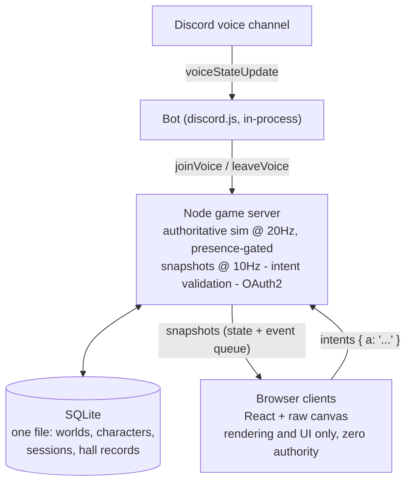

# Guild of the Open Mic

**A Discord-native, presence-driven idle RPG.** When people join a Discord voice channel, their persistent characters walk into a shared 2.5D pixel-art world and fight as a party. When the last person leaves, the world freezes mid-swing and waits. The game is a side effect of hanging out: you don't play it so much as it plays alongside you while you talk.

**Play it in your browser right now: https://wasomma.github.io/guild-mp/** — the single-player prototype as one self-contained page, no install, no server. The multiplayer world below is the real thing and needs a server.

## The design intent

1. **Presence is the input device.** No controller, no clicks required. Joining voice *is* joining the game. The simulation only advances while someone is present, so there is no offline grind and no FOMO — the world's story only moves when the group is actually together.
2. **One shared canon, not parallel saves.** A single persistent campaign per Discord server. Everyone watching sees the same authoritative entities. Prestige ("Retell the Tale") is a majority *vote*; finished chapters are enshrined in a Hall of Legends with MVPs and loot records; sessions end with an auto-posted Discord chronicle. Social memory is a first-class system.
3. **Cooperative texture without APM.** The design problem is making a zero-input game legible and social: tank-focused aggro plus telegraphed party-wide cleaves (so healers visibly matter), interruptible boss windups, chapter mutators that twist each prestige run's rules, and presence buffs that scale with the number of people in voice.
4. **HD-2D presentation on a strict pixel grid** (Octopath-inspired): depth-blurred scene layers, tilt-shift banding, bloom, material-ramped weapon models, rarity-visible gear rendered on the sprite, and a zoomed inspect portrait — because the reward loop is *seeing* the rare thing you earned.

## Architecture



The decisions worth knowing:

- **The simulation is a pure, headless module** (`shared/sim.js`): every game rule, no rendering, no I/O. It runs identically under Node and in the browser. Visual moments are emitted as *events* ("crit burst at x,y"); clients translate them into particles locally — the wire stays small at 10Hz while rendering runs at 60fps with client-side interpolation.
- **Server-authoritative, intent-based networking.** Clients send `{a: "buyPotion"}`-style intents; the server validates everything. A modified client can *ask* but cannot *take*.
- **Hibernation as an architectural feature.** Worlds load on first join, tick while occupied, write through on significant actions, and unload after the last leave. The ops cost of an idle community is zero, and one process shards to hundreds of guilds because worlds share nothing.
- **Boring, durable persistence:** one SQLite file, additive guarded migrations, characters keyed by Discord snowflake so identity survives nickname changes, device switches, and disconnects. Backup is copying one file.
- **Two deliberately duplicated codebases.** A single-file prototype (`prototype/guild-idle.jsx`, for instant sandboxed iteration in claude.ai artifacts) and the multiplayer build share *textually identical* game logic and sprite code, differing mechanically only at the I/O seams (direct sfx calls vs. emitted events). Every change lands in both — see the cardinal rule in CLAUDE.md. The prototype also ships as `prototype/guild-of-the-open-mic.html`, a self-contained playable page (React bundled inline) that GitHub Pages serves at the link above.
- **Testing without a framework:** headless sim scripts drive `joinVoice`/`tick`/`applyIntent` and assert on world state; a mock-canvas soak runs the *real* draw code through 24 scenarios; geometry tests verify layout invariants like formation spacing never clipping pet sprites.

Want to *see* it? Two commands (below) put the live world in your browser. For the full design rationale read [ARCHITECTURE.md](ARCHITECTURE.md); for contributor conventions read [CLAUDE.md](CLAUDE.md); for the why behind recent decisions read [docs/SESSION-JOURNAL.md](docs/SESSION-JOURNAL.md); for hosting see [DEPLOY.md](DEPLOY.md).

## Running it

You need Node 18 or newer and two terminals.

Terminal 1, the game server:

```
cd server
npm install
npm start
```

Terminal 2, the web client:

```
cd client
npm install
npm run dev
```

Open the URL Vite prints (usually http://localhost:5173). Open it in two browser windows side by side to see the shared world: join a user from one window and watch them walk into frame in both.

## What is where

`shared/sim.js` holds every game rule and no rendering. The server ticks it; the Discord bot calls its `joinVoice` and `leaveVoice` functions directly.

`server/index.js` runs the world at 20Hz, broadcasts snapshots at 10Hz over WebSockets, validates every client intent, and freezes the simulation whenever nobody is in the party (the hibernation rule). `server/db.js` persists everything to SQLite (`server/guild.db`): every 20 seconds, on shutdown, and instantly whenever a purchase, skill point, prestige, or departure happens.

`client/` renders snapshots on a canvas with interpolation, turns server events into particles and floating numbers locally, and sends every button press to the server as an intent. The voice panel in the sidebar is a development stand-in; users who arrive through the real Discord bot show a "discord" badge there instead of Join and Leave buttons, since only real voice presence may control them.

`server/bot.js` is the Discord bot. It runs inside the game server process and turns voice-channel presence into party membership, keyed by Discord user IDs.

## Connecting Discord

1. Create an application at https://discord.com/developers/applications, add a Bot to it, and copy the bot token.
2. Invite the bot to your server with this URL (replace CLIENT_ID with your application's client ID): `https://discord.com/oauth2/authorize?client_id=CLIENT_ID&scope=bot&permissions=3072`. Permission 3072 is View Channels plus Send Messages, which is only needed if you want milestone announcements.
3. In Discord, enable Developer Mode (Settings, Advanced), then right-click your voice channel and Copy Channel ID. Do the same for a text channel if you want announcements.
4. Create `server/.env` with:

```
DISCORD_TOKEN=your-bot-token
VOICE_CHANNEL_ID=your-voice-channel-id
ANNOUNCE_CHANNEL_ID=optional-text-channel-id
```

5. Start the server. It logs "Discord bot online" and from then on, joining that voice channel is joining the game. If someone is already sitting in the channel when the server boots, they are synced in immediately.

Characters are keyed by Discord user ID, so nickname changes, device switches, and disconnects never lose a character. Without a `.env`, the bot stays off and everything works exactly as before.

## Locking the web client to Discord identities (OAuth)

By default the web client runs in open dev mode: anyone connected can manage any character. To require login and ownership:

1. In your Discord application (the same one as the bot), open OAuth2 and add a redirect: `http://localhost:8787/auth/callback` (or your server's public equivalent).
2. Copy the Client ID and Client Secret from that page into `server/.env`:

```
DISCORD_CLIENT_ID=your-client-id
DISCORD_CLIENT_SECRET=your-client-secret
OAUTH_REDIRECT_URI=http://localhost:8787/auth/callback
CLIENT_URL=http://localhost:5173
```

3. Restart the server. It logs "Discord OAuth is ON".

From then on a "Log in with Discord" button appears in the client header. Anyone can spectate without logging in, but acting requires identity: your own character's wardrobe, skills, and respec are yours alone; guild-wide actions (potions, prestige, legacy upgrades) require any logged-in member; characters created from the dev sidebar are manageable by any logged-in user. Locked panels say who owns the character. Sessions are stored server-side in SQLite and survive restarts; the logout link revokes them.

## Persistence

Stop the server with Ctrl+C (or crash it, that works too) and start it again: the campaign resumes at the same stage, and every character (level, gear, skills, wardrobe) is waiting in the roster for its owner to rejoin voice. State lives in two SQLite tables, `worlds` and `characters`, inside `server/guild.db`. A `world.json` from the earlier version migrates into the database automatically on first boot. Delete `guild.db` to start a fresh legend.
